<!-- README.md is generated from README.Rmd. Please edit that file -->

# CawthronColours 

<!-- badges: start -->
<!-- badges: end -->

The goal of `CawthronColours` is to to provide official Cawthron colour
palettes for use in R. The colour palettes are a mix of well known
(e.g. `viridis`) and custom palettes. All are colour blind friendly.

Our data visualisation colours have been developed for the sole purpose
of conveying Cawthron’s data insights through plots, graphs and maps.

Cawthron’s primary, secondary and tertiary colour palettes should be
used in the first instance for all other design applications.

A diverse array of data visualisation colour palette options are
available, spanning across sequential, diverging, and categorical
datasets. Select the palette that most effectively conveys your data
narrative. Remember to consider what your chosen colours might mean to
your audience.

Colour blindness was taken into consideration when developing these
colours. A colour blindness reference for each hue can be found in
Section D of Cawthron’s brand guidelines.

If standardised colours are used in your discipline to represent
specific data— such as the Trophic Level Index used in lakes, we
encourage you to adopt these for consistency and alignment.

Inspiration for package implementation came from the the
[`Manu`](https://github.com/G-Thomson/Manu) colour palette package. All
palettes except `viridis` and `lawa` were designed by Jacqui Stuart in
consultation with McKayla Holloway.

## Installation

The package is currently hosted on GitHub and can be installed as
follows:

``` r
# install.packages("devtools")
devtools::install_github("cawthron/CawthronColours")
```

## Usage

The colour palettes are stored as a list named `cawthron_palettes`.
There are categorical (`caw_cat_*`), sequential (`caw_seq_*`) and
diverging (`caw_div_*`) palettes.You can see a list of the available
palettes like so:

``` r
library(CawthronColours)
names(cawthron_palettes)
#>  [1] "caw_div_1" "caw_div_2" "caw_div_3" "caw_seq_1" "caw_seq_2" "caw_seq_3"
#>  [7] "caw_seq_4" "caw_seq_5" "caw_cat_1" "caw_cat_2" "caw_cat_3"
```

A helper function `get_pal()` returns the desired colour palette as a
vector, for example:

``` r
get_pal("caw_cat_1")
#>  [1] "#f48521" "#fbd872" "#acd58e" "#76c044" "#4a7637" "#2f4926" "#4ba791"
#>  [8] "#2f725e" "#004f52" "#175c7d" "#029cbd" "#7ac4d3" "#9b99cd" "#6860a0"
#> [15] "#702365" "#e8b5d4" "#85243f" "#c22c43" "#d45f74" "#f8d3ca"
```

There is also a helper function `print_pal()` which displays the palette
in the graphics window.

``` r
caw_col <- get_pal("caw_cat_1")
print_pal(caw_col)
```

<!-- -->

Below are a few examples of plots made using
[`ggplot2`](https://ggplot2.tidyverse.org/). We use the
[`gapminder`](https://github.com/jennybc/gapminder) package to get some
toy data and
[`rnaturalearth`](https://github.com/ropensci/rnaturalearth) to get a
map of New Zealand. The key `ggplot2` functions needed to use the
`CawthronColours` palettes are:

For categorical palettes:

- `scale_colour_manual(values = get_pal("caw_cat_1"))`
- `scale_fill_manual(values = get_pal("caw_cat_1"))`

For diverging or sequential palettes:

- `scale_colour_gradientn(colours = get_pal("caw_seq_1"))`
- `scale_fill_gradientn(colours = get_pal("caw_seq_1"))`

``` r
library(gapminder)
library(ggplot2)
library(dplyr)
library(rnaturalearth)

# For categorical colours we use scale_colour_manual (or scale_fill_manual)
ggplot(gapminder, aes(x = continent, y = lifeExp, colour = continent)) +
  geom_jitter(position = position_jitter(width = 0.1, height = 0)) +
  scale_colour_manual(values = get_pal("caw_cat_1")) +
  theme_classic() +
  theme(legend.position = "none")
```

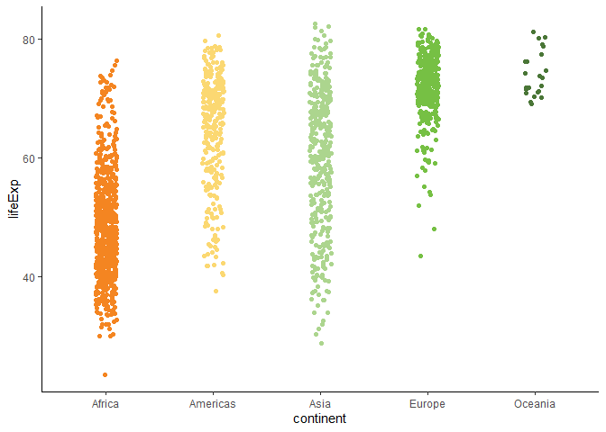<!-- -->

``` r
# for continuous or sequential palettes we use scale_fill_gradientn (or scale_colour_gradientn)
ggplot(faithfuld) +
  geom_tile(aes(waiting, eruptions, fill = density)) +
  scale_fill_gradientn(colours = get_pal("caw_seq_1"))  +
  theme_classic() +
  theme(legend.position = "none")
```

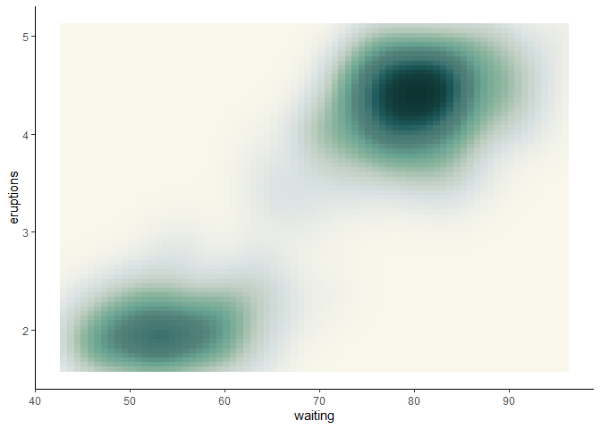<!-- -->

``` r
# download a map of NZ
nz_map <- rnaturalearth::ne_states(country = "new zealand", returnclass = "sf")

# remove outlying islands
nz_map <- nz_map |>
  dplyr::filter(region %in% c("South Island", "North Island"))

# add a random variable for each region
nz_map <- nz_map %>%
  dplyr::select(name) |>
  dplyr::mutate(count = runif(dplyr::n(), 0, 100))

# plot - use scale_fill_gradientn and scale_colour_gradientn to colour the
# regions by the random variable we just created
ggplot(nz_map, aes(fill = count, colour = count)) +
  geom_sf() +
  scale_fill_gradientn(colours = get_pal("caw_seq_1"))  +
  scale_colour_gradientn(colours = get_pal("caw_seq_1"))  +
  theme_void() +
  theme(legend.position = "none")
```

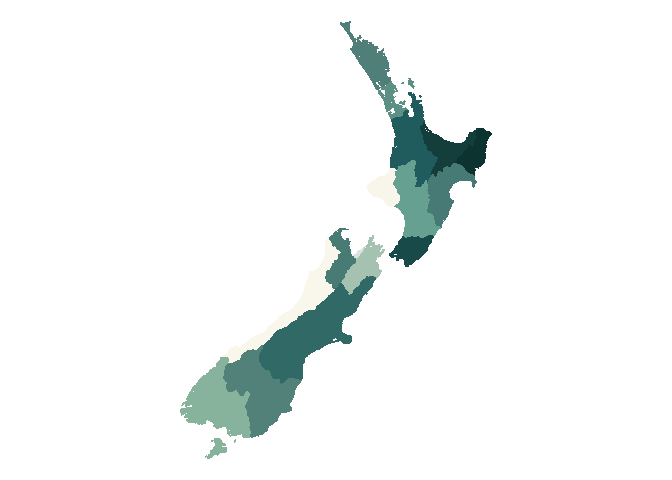<!-- -->

# Palettes

Overview of the different colour palettes

## Categorical palettes

Use these scales to distinguish between categories that don’t have an
intrinsic order such as taxonomic data.

In an ideal world you wouldn’t have more that 12 categories displayed on
a single plot. In exceptional scenarios you can generate a
‘half-saturated’ color variation of the chosen scale to expand colour
choices while maintaining clarity.

### Cawthron rainbow - `caw_cat_1`

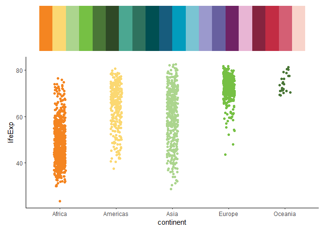<!-- -->

### Warm and cool - `caw_cat_2`

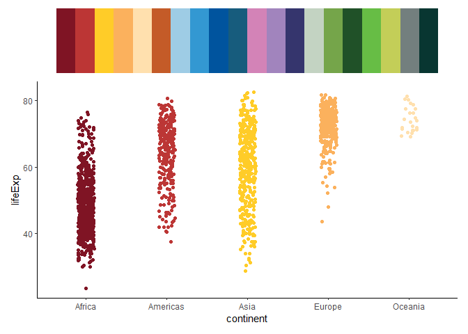<!-- -->

### Lawa - `caw_cat_3`

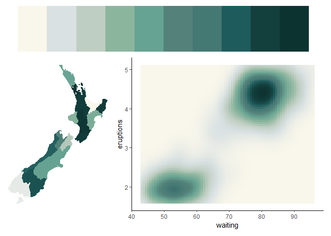<!-- -->

## Sequential palettes

Sequential colour scales represent gradients of a single hue,
transitioning from light to deep tones or vice versa. They provide a
means of depicting numerical values that span from low to high, such as
temperature plotting.

These colour scales can be utilised in two ways: as discrete classes,
where each colour represents a distinct category, or as unclassed
gradients, forming a continuous spectrum.

### Ocean green - `caw_seq_1`

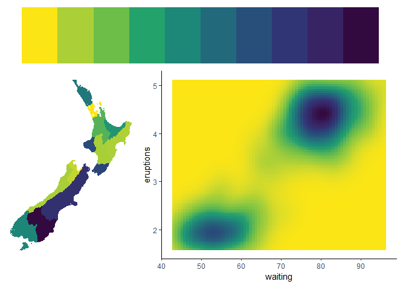<!-- -->

### Viridis - `caw_seq_2`

<!-- -->

### Forest - `caw_seq_3`

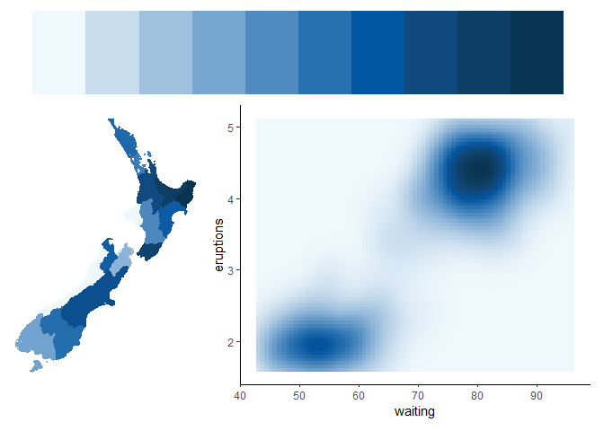<!-- -->

### Sea blue - `caw_seq_4`

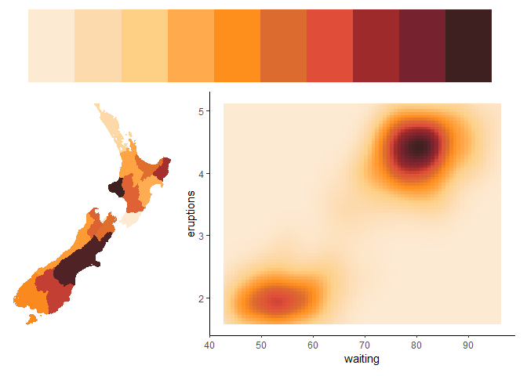<!-- -->

### Heat - `caw_seq_5`

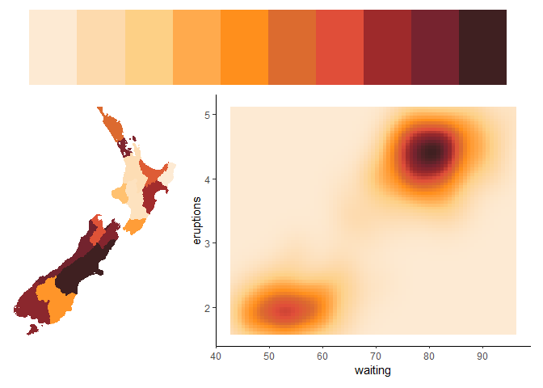<!-- -->

## Diverging palettes

Diverging colour scales differ from sequential scales by incorporating a
bright central value and darker tones at both extremities, enhancing
data differentiation compared to sequential counterparts. Frequently
used for portraying positive and negative values, these scales are
particularly effective when:

- A significant midpoint exists.
- Emphasising extremes, especially when highlighting the highest and
  lowest values.
- Enhancing differences in the data.

Nonetheless, the drawback of diverging colour scales lies in their
non-intuitiveness, requiring a colour key to avoid confusion. Readers
may struggle to discern “low” from “high,” or which values are “better”
and which one is “worse”. A thoughtful colour selection, such as
associating red with “negative” and green with “positive,” can alleviate
ambiguity and improve

### Sun to sea - `caw_div_1`

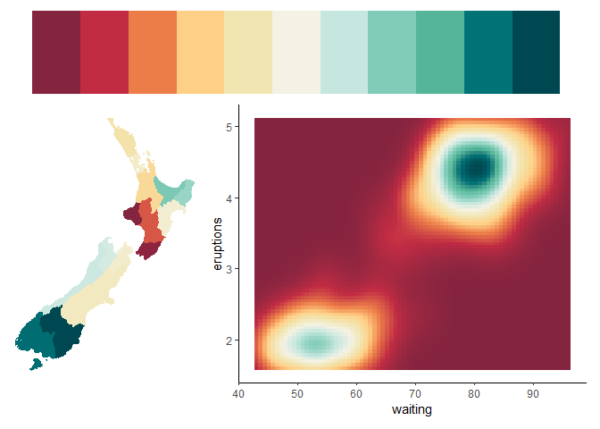<!-- -->

### Hot to cold - `caw_div_2`

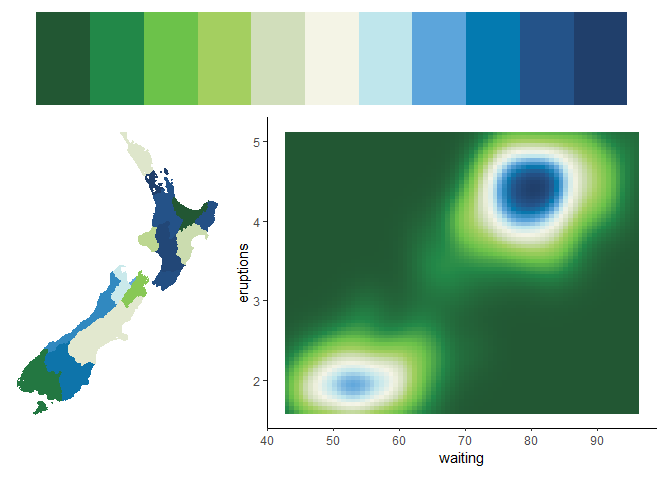<!-- -->

### Forest to river - `caw_div_3`

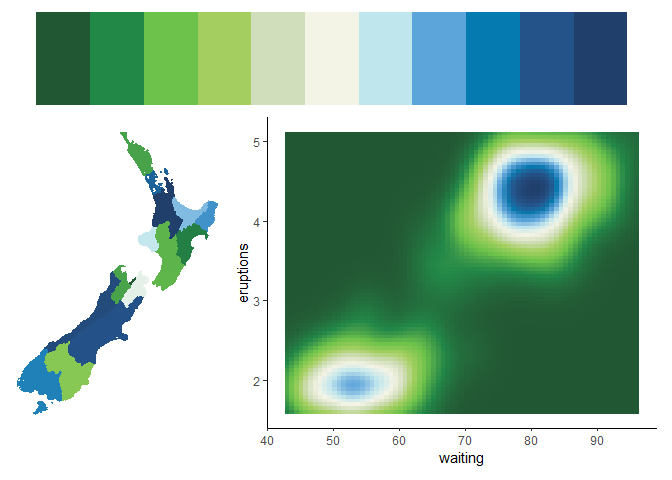<!-- -->
