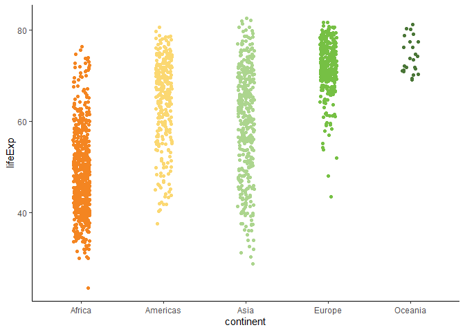
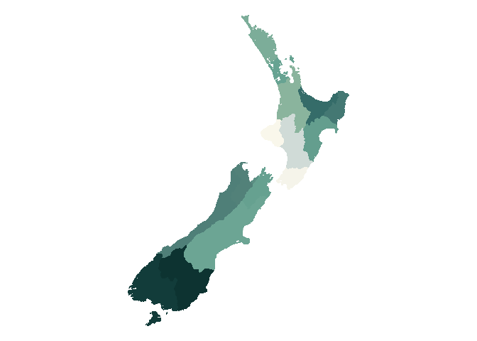
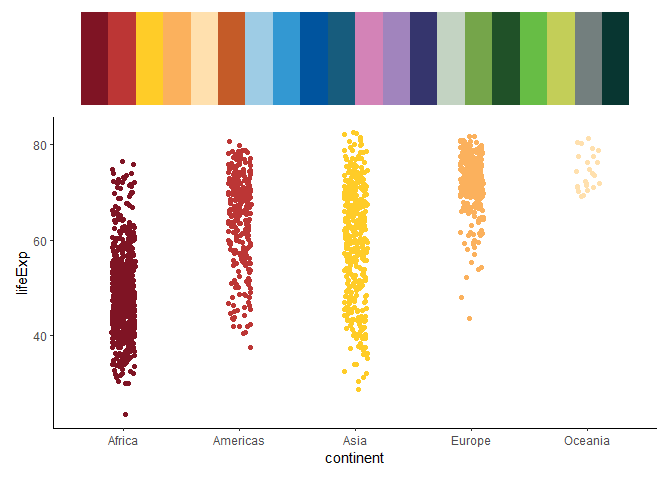
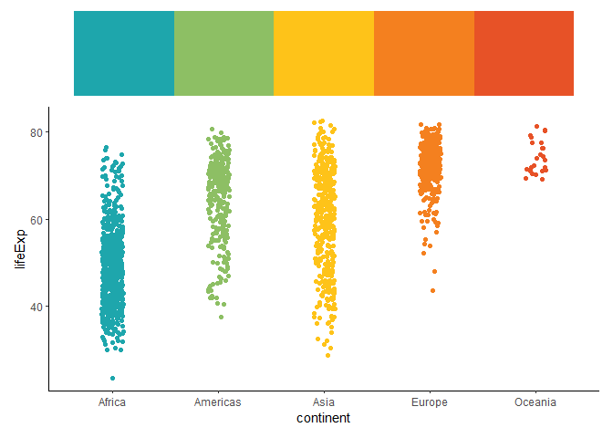
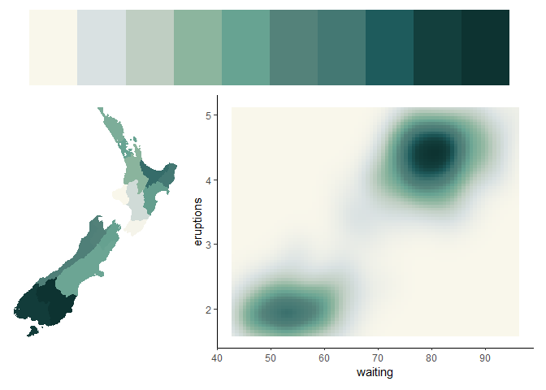
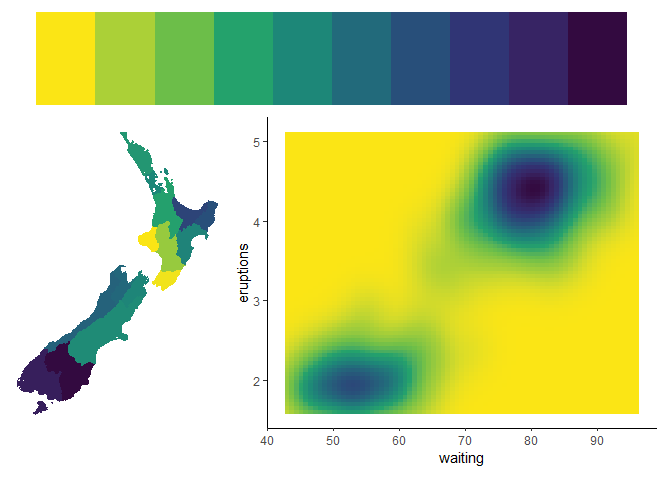
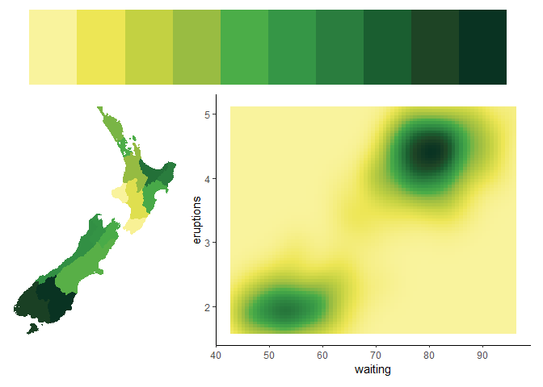
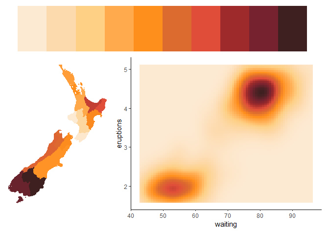
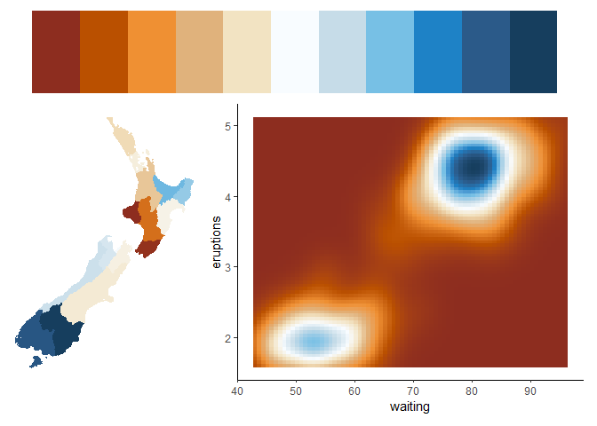

<!-- README.md is generated from README.Rmd. Please edit that file -->

# CawthronColours 

<!-- badges: start -->
<!-- badges: end -->

## package in development - not yet functional!

The goal of `CawthronColours` is to to provide official Cawthron colour
palettes for use in R. The colour palettes are a mix of well known
(e.g. `viridis`) and custom palettes. All are colour blind friendly.

Inspiration for package implementation came from the the
[`Manu`](https://github.com/G-Thomson/Manu) colour palette package. All
palettes except `viridis` were designed by XXX.

## Installation

The package is currently hosted on GitHub and can be installed as
follows:

``` r
# install.packages("devtools")
devtools::install_github("cawthron/CawthronColours")
```

## Usage

The colour palettes are stored as a list named `cawthron_palettes`.
There are categorical (`caw_cat_*`), sequential (`caw_seq_*`) and
diverging (`caw_div_*`) palettes.You can see a list of the available
palettes like so:

``` r
library(CawthronColours)
names(cawthron_palettes)
#>  [1] "caw_div_1" "caw_div_2" "caw_div_3" "caw_seq_1" "caw_seq_2" "caw_seq_3"
#>  [7] "caw_seq_4" "caw_seq_5" "caw_cat_1" "caw_cat_2"
```

A helper function `get_pal()` returns the desired colour palette as a
vector: For example:

``` r
get_pal("caw_cat_1")
#>  [1] "#f48521" "#fbd872" "#acd58e" "#76c044" "#4a7637" "#2f4926" "#4ba791"
#>  [8] "#2f725e" "#004f52" "#175c7d" "#029cbd" "#7ac4d3" "#9b99cd" "#6860a0"
#> [15] "#702365" "#e8b5d4" "#85243f" "#c22c43" "#d45f74" "#f8d3ca"
```

There is also a helper function `print_pal()` which displays the palette
in the graphics window.

``` r
caw_col <- get_pal("caw_cat_1")
print_pal(caw_col)
```

<!-- -->

Below area few examples of plots made using
[`ggplot2`](https://ggplot2.tidyverse.org/). We use the
[`gapminder`](https://github.com/jennybc/gapminder) package to get some
toy data and
[`rnaturalearth`](https://github.com/ropensci/rnaturalearth) to get a
map of New Zealand.

``` r
library(gapminder)
library(ggplot2)
library(dplyr)

# For categorical colours we use scale_colour_manual (or scale_fill_manual)
ggplot(gapminder, aes(x = continent, y = lifeExp, colour = continent)) +
  geom_jitter(position = position_jitter(width = 0.1, height = 0)) +
  scale_colour_manual(values = get_pal("caw_cat_1")) +
  theme_classic() +
  theme(legend.position = "none")
```

<!-- -->

``` r
# for continuous or sequential palettes we use scale_fill_gradientn (or scale_colour_gradientn)
ggplot(faithfuld) +
  geom_tile(aes(waiting, eruptions, fill = density)) +
  scale_fill_gradientn(colours = get_pal("caw_seq_1"))  +
  theme_classic() +
  theme(legend.position = "none")
```

<!-- -->

``` r
# download a map of NZ
nz_map <- rnaturalearth::ne_states(country = "new zealand", returnclass = "sf")

# remove outlying islands
nz_map <- nz_map |>
  dplyr::filter(region %in% c("South Island", "North Island"))

# add a random variable for each region
nz_map <- nz_map %>%
  dplyr::select(name) |>
  dplyr::mutate(count = runif(dplyr::n(), 0, 100))

# plot - use scale_fill_gradientn and scale_colour_gradientn to colour the
# regions by the random variable we just created
ggplot(nz_map, aes(fill = count, colour = count)) +
  geom_sf() +
  scale_fill_gradientn(colours = get_pal("caw_seq_1"))  +
  scale_colour_gradientn(colours = get_pal("caw_seq_1"))  +
  theme_void() +
  theme(legend.position = "none")
```

<!-- -->

# Palettes

Overview of the different colour palettes

## Categorical palettes

### Cawthron rainbow - `caw_cat_1`

<!-- -->

### Warm and cool - `caw_cat_2`

<!-- -->

## Sequential palettes

### Tuaone - `caw_seq_1`

<!-- -->

### Viridis - `caw_seq_2`

<!-- -->

### Tāne Mahuta - `caw_seq_3`

<!-- -->

### Tangaroa - `caw_seq_4`

<!-- -->

### Papatūānuku - `caw_seq_5`

<!-- -->

## diverging palettes

### Sun to sea - `caw_div_1`

<!-- -->

### Hot to cold - `caw_div_2`

<!-- -->

### Whenua ki te wai - `caw_div_3`

<!-- -->
